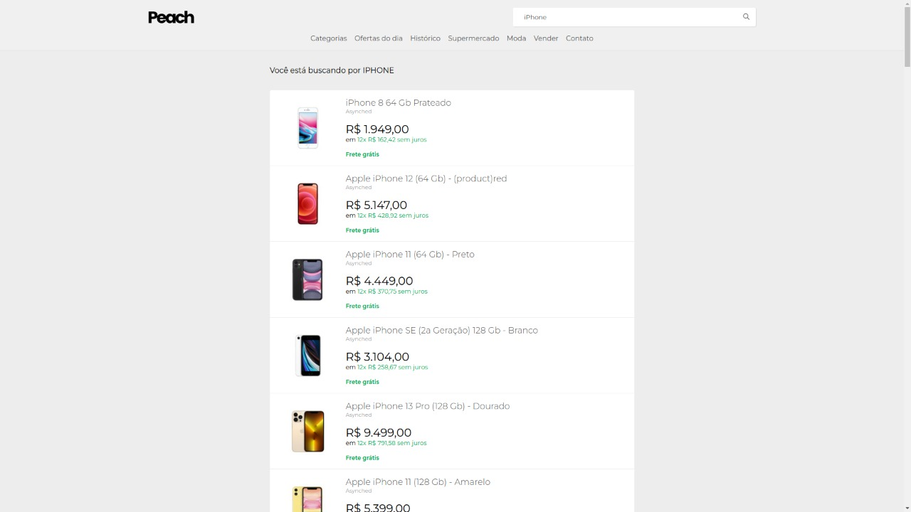
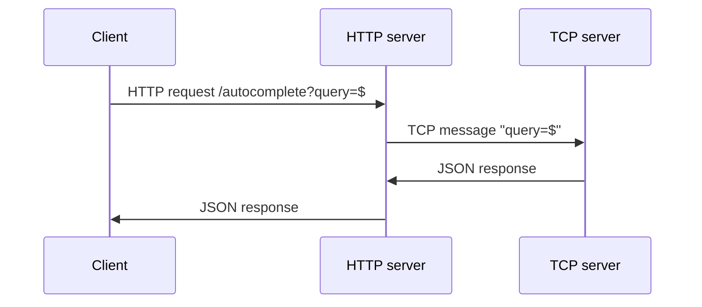

# autocomplete-api

An autocomplete API powered by Rust and NodeJS.

## Preview



## About the project

This is meant to be a realtime API for a list of indexed products, in the root folders you can see 3 main ones:

1. ac-server - The server for the autocompletion
2. backend - The HTTP server that powers the realtime HTTP requests
3. web - The client app that renders a query from the backend.

```
root/
  ├─ 📂 ac-server/
  ├─ 📂 backend/
  ├─ 📂 web/
  ├─ 📑 README.md - You're here.

```

## About the system

The system is powered through an TCP server mostly, whenever a request through the API, it is powered to the Rust engine, which executes the query and returns a list of products. A schema of the app can be seen down below.

[](https://mermaid.live/edit#pako:eNptkE9LAzEQxb9KGDxWvAeshyqIBxW6x70MyWsNbP6YzAql9LubdFu2rN4m895v3mSOZKIFaSr4HhEMnh3vM_s-KJU4izMucRC1GRyCLLuvXfepCvIP8lLqNrPStGmAul-vbyk9PXILL6IeeJRook8DBE-1lw-Pd42-Qc4j5un6XHuUwnuonq4QNWy2_Q1-23681-CSYij4L2PaeGGkFXlkz87Wmx0b1pN8waMnXUuLHY-DtPRTtY7JsuDFOomZ9I6HghW1P24PwZCWPOJqutz94jr9AlIRi4c)

<!-- Original mermaid chart. xD

-->

> Each project has a build configuration that can be seen in it's README.

## Author

|  |
| ------------------------------------------------------ |
| [Eder Lima](https://github.com/asynched)               |
